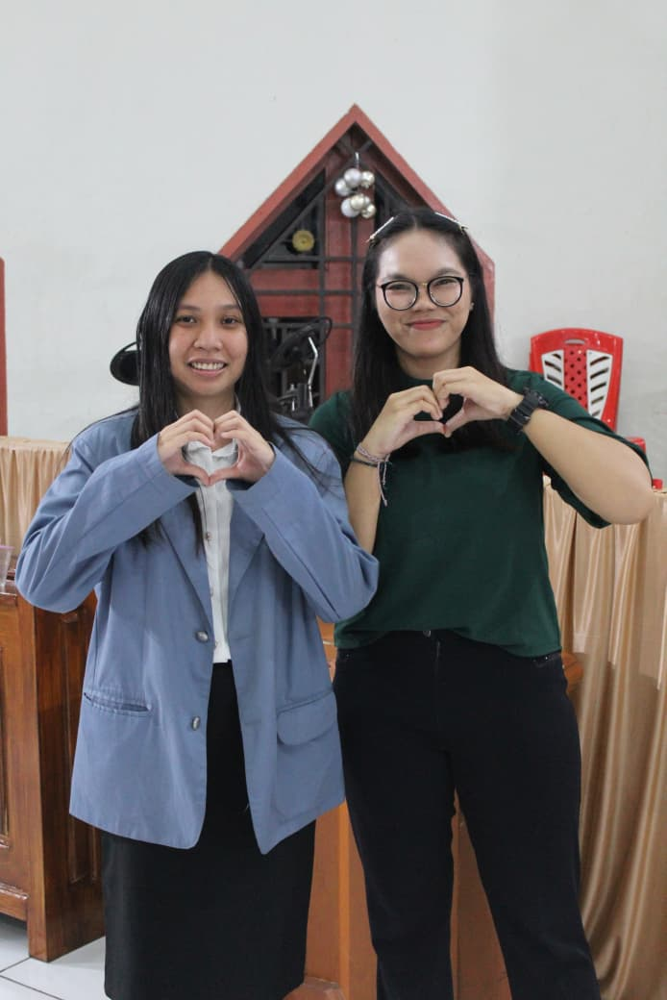
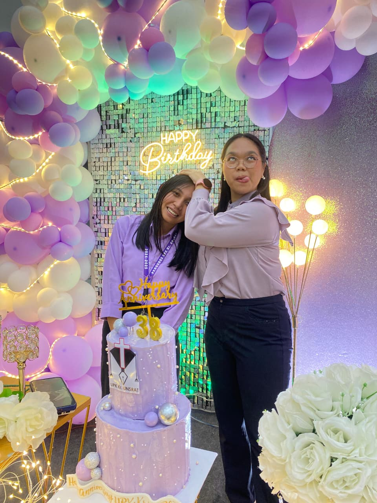

<head>
<meta charset="UTF-8">
<meta name="viewport" content="width=device-width, initial-scale=1.0">
<title>Kak Nia Anehhhhh💛</title>

</head>

<body>

<audio id="bgMusic" loop>
  <source src="Memories (Instrumental).mp3" type="audio/mpeg">
</audio>

Play Music

  

    

    

    

      <input type="password" id="password" placeholder="Masukkan password">
       
      <button id="bukaBtn" onclick="checkPassword()">Buka</button>
    

  

  

    

    <button class="btn jump" onclick="alienClick()">👽</button>
  

  

    <div class="text" data-text="Sebenarnya dibagian ini dpe inti cuma mo bilang terimakasih kak 🤣🤣🤣 jadi mo bilang terimaksih karna kak so dampingi pa queen di tahun ini ee bln cm queen so dampingi nb eee tnggu bkn yg ini cm personal jadi nda ush nb tnggu beking baru 😭😭😭

Nah pertama itu terimaksih karn kak so ba iyo jd mtv di fast wkwkw 😭😭🤣 krn kalo kak nda ba iyo nda mo dampingi pa queen, terimaksih karna so dampingi 1 tahun ini, terimakasih karn so banya kak ada kase bljr pa queen, terimaksih karna setiap hari selalu dpa ceramah biasa 😭😭😭😭, terimaksih krn selalu revisi semua yg queen mo beking 😭😭😭🤣🤣 ee mksdnya kak terimaksih selalu jadi orng pertama yang queen mo tnya2 akng tentang surat tentang notulensi pokoknya tentang semua 😭 terimaksih karna selalu jadi orng pertama queen ja minta akng saran ja tnha pendapat dengan ja tnya pertanyaan yg sbnrnya so nda perlu mo tnya😭😭😭😭 

Satu tahun ini setiap hari ada kak mo kase bljr pa queen tnggu mo coba tls yang queen inga dulu (1) queen lupa kyp sampe kak blng ini kata2 cm itu kata2 so tertanam pa queen pe otak kak😭😭😭 jadi kak blng itu bgni iniisiatif memang butuh pengorbanan, terutama sikap hati bgtu kak blng mar lupa krn apa sampe blnh itu (2) nah ini kak blng pas apa na ihh aneh lupa trs queen krn queen blng banya proker di pemerhati sto nda jalan kong kak blng bgni kita nda bisa pelayanan itu jadi sempurna saat trng terbatas krn ketidaksempurnaan, tapi yang penting saat trng jalankan pelayanan trng tahu sapa yg trng kalo trng melayani Tuhan yang sempurna atau maha sempurna. 😭😭😭 kalontrng pe hati so betul² untuk Tuhan, semua pasti mo jalan sebagaimana harusnya atau mestinya kak ada blng😭😭😭 (3) ini yang kak blng orng2 yang pake alasan masih manusia itu cuma cari pembenaran nah ini sbbrnya 1 paket dngn yg kak ada blng yg dari kak irfan itu yg kalk ke adet ktb jngn pernah blng de kak ini masih manusia jad jangan iko pa kak ne bgtu sto😭😭😭 padahal harusnya fengan yrng ikut paulus pe kata2 trng blb lebih mi jaga, mo petbaiki denhan mo berusaha untuk nda buat hal2 yang nda baik krn itu perintah Tuhan for jadi sempurna. Jadi jnhn lake alasan masih manusia krn cm mo cari oembenaran😭 (4) nah ini waktu queen selalu tnya kyp di sek kong kak blng kalo semua ditutup dan diyakini kerna Tuhan pilib, itu so jawaban mutlak abis itu lanjut kak blng kadang oenjelasan dari mamudia itu bkn buat trng rendah hati mar tinggi hati, abis itu kak blng lagi kalo trng so dpt jwbn di awal kyp samoe ade di posisi itu ada 2 kemhngkinan trng mo jalankan oekayanan tulus krn Tuhan so pilih pa trng atau trng jalani pelayanan krn trng rasa blh tanpa Tuhan. Itu sbnrnya mantap skli kak😭😭😭 (5) oooo ini yang tentang memaklumi sto 😭😭 kak blng orng nda akn berubah kalau drng nda tahu apa frng pe kesalahan jadi trng itu harus kase tahu kalo drng slh, tegur dngn kasih karna lebih baik teguran yang nyata daripada kasih yang tersembunyi😭😭😭. Dengan ada lagi kak ada bilang apa ee merangkul bukan apa sto intinya soal memaklumi ini susah mo kase ilang kak vm kak prnh blng nnt drng nda berproses atau apa nah intinya bgtu cm susah mo kase ilang nda tahu bgm 😭😭😭😭 (6) oooo ini pas awal2 kak nia blng kalo trng berharap orng jd lebih baik trng yg harus kase cnth duluan disini lay kak ada blng tentang paulus😭😭😭 ikutilah teladan ku😭😭🤣🤣 jadi hngn bersembunyi di balik kata dek kalo kak nanti buat salah jang ikut ne 😭😭pdhl harudnya trng jadi teladan bgtuuu mantap skli luarbiasa 🤣 (7) nah ini kak kase inga pas apa ee yg kak ririn atau yg queen di sekre diam2 itu nah abis mon tag di grup 😭 kak blng mau secapek apapun, selelah apapun, semarah apapun, jangan samoe orng lain kena inbasnya oo nda ini kak blng krn kak ririn😭(8) nah ini kak kase inva pa queen jangan sering2 tnda, sering2 mengavaikan, sering2 bodo amta 😭😭😭 tembus dalam hati sampe jantung kak😭😭 (9) kak pe kata2 yang so tertanam 1 tahun ini yang lain blh dek gak boleh 😭😭 mar itu kata2 sbnrnya bgs skli beking tetap berthaan😭🤣🤣🤣 (10) nah ini kata2 baru skli td 😭😭 kak blng Jangan abaikan orang lagi dek.  Apalagi dek sudah dampingi pengurus sebagai MTV 🤣🤣🤣😭😭😭😭 

Nah jadi terimaksih kak karna semua yang kak blng2 itu queen blh ditegur dan disadarkan wkwkkw😭😭 iyo terimakasih krn kak selalu kase inga kalo harus rendah hati 😭😭😭 sama kak selalu blng proses untuk rendah hati de😭😭😭 jadi terimaksih kak untuk kata2 yg selalu menampar wkwkwkwkw terimakasih krn selalu marah2 😭😭😭 ooo dengan terimaksjh karna selalu bersedia kalk minta tolong buat renungan dadakan, terimaksih kak so selalu bantu pa queen 😭😭😭 (bantu ba revisi wkwkwkw, nda katu ee bercanda kak🤣🤣🤣) terimaksih karna selama 1 tahun ini kak selalu kase deadline for semua yang queen mo buat kak betul2 itu sangat membantu😭😭😭 oooo dengan sorry krn tu kalender kerja nda jd sampe akhir kak😭😭😭😭 terimaksih karna kak si bertahan dampingi pa queen wkwkw queen tahu no 1 tahun ini banya aneh2 queen ja beking ja tnya astaga 😭😭🤣🤣 ooo inj terimaksih kak ja ba teman kalo queen veking notulen (krn selalu kak yg queen mk tnya2 akng trs) terimakasih selalu ja bls chat tngh mlm kalo queen ja tnya2 akng😭😭😭 oiyo terimaksih selalu ja kase ingt jangan lupa makan wkwkwkw dengan minum air 😭🤣🤣🤣 oiyo biasa kalo queen so bingo mo buat apa duluan karna so banya mo buat sellau queen mo blng pa kak jadi terinmakasih for sikusi2 yg kak so kase 🤣😭 nah ini amper lupa terimaksih karn dari sempro sampe skripsi selalu sebelum mulai mo doa dengan kak krn itu doa mujarab sklj 😭🤣🤣🤣 terimaksih krn kak so srh hapus tu game spya fokus di studi dengab pelayanan kak blng bgtu ee wkwke, intinya kak terimakasih for 1 tahun ini wkwkwk so nda tahu queen mk tls apa😭😭😭😭 sbnrnya kak bkn cm sekedar jd pendamping mtv mar so sama queen pe kaka sendiri jadi terimaksih kak nia untuk 1 tahun ini ee nda 2 tahun ini so sabar menghadapi queen 🤣

Sebanrnya pas kak blng so nda mo lanjut jadi mtv rasa bgmn ee krn sbnrnya queen suka kak jadi mtv cm dari pas masih di pemerhati kan kak so blng to nda mo lanjut queen so terima dan pasrah wkwkw krn kak prnh blng to nda bersama di wadah pelayanan yang sama bukan berarti tidak bisa melayani sama-sama jadi wktu itu yah nda apa2 cm tahun ini wktu kak blng nfa mo hd mtv sbnrnya queen yakin kak mo ba iyo 😭😭🤣🤣krn kak nia bkn orng lain kan kak selalu se bljr nda afa alasn trng mo menolak pelayanan jadi bersyukur sbnrnya karna kak ba iyo jd koordi mtv 

Jadi terimaksih kak selalu jadi panutan dan teladan wkwkwkwk cm queen tetap tako kalo kak marah😭😭😭😭🤍">

    <button class="btn jump" onclick="loveClick()">💛</button>
  

  

    

    

  

</body>
</html>
